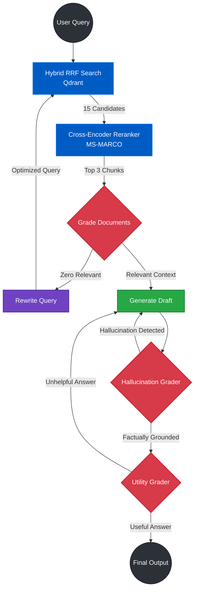

Copy and paste this directly into your `README.md`. It uses Mermaid.js to render a native architecture graph on GitHub, replaces dense text with clean tables, and details the exact engineering mechanisms.

````markdown
# Enterprise Agentic RAG Pipeline


A production-grade, self-correcting Retrieval-Augmented Generation (RAG) architecture. This system moves beyond linear RAG implementations by utilizing a cyclic LangGraph state machine with autonomous guardrails to strictly prevent hallucinations, evaluate its own utility, and dynamically rewrite failed queries.

---

## 🧠 System Architecture

The pipeline implements a **Corrective Self-RAG** workflow. The agent evaluates retrieved context and its own generated drafts in real-time, looping back to rewrite or regenerate until strict quality thresholds are met.


````

---

## ⚙️ Technical Stack

| Layer              | Component             | Implementation Details                                                           |
| ------------------ | --------------------- | -------------------------------------------------------------------------------- |
| **Orchestration**  | LangGraph & LangChain | Manages the cyclic state machine, tracking generation retries and context state. |
| **LLM Engine**     | Groq (`gpt-oss-20b`)  | High-speed inference for both generation and LLM-as-a-Judge grading nodes.       |
| **Vector Storage** | Qdrant                | Local containerized vector database utilizing Reciprocal Rank Fusion (RRF).      |
| **Embeddings**     | FastEmbed             | Dual-encoder setup: `BGE-Small` (Dense) + `SPLADE` (Sparse).                     |
| **Reranking**      | HuggingFace           | `ms-marco-MiniLM-L-6-v2` Cross-Encoder for high-precision semantic sorting.      |
| **Backend API**    | FastAPI               | Asynchronous REST API serving the agent execution graph.                         |
| **Frontend UI**    | Streamlit             | Custom reactive chat interface with a compressible execution trace state.        |

---

## 🔬 Advanced Engineering Features

### 1. Two-Stage Retrieval (High Recall + High Precision)

Standard RAG suffers from the "Lost in the Middle" problem. This architecture solves it by decoupling retrieval from context injection:

- **Stage 1 (Recall):** Qdrant executes a hybrid dense/sparse RRF search to retrieve 15 broad candidate chunks.
- **Stage 2 (Precision):** A transformer-based Cross-Encoder reranks all 15 chunks against the specific user query, passing only the top 3 highest-scoring chunks to the LLM.

### 2. Autonomous Guardrails (Self-RAG)

The system refuses to output unverified data. Post-generation, the draft is intercepted by two distinct LLM evaluator nodes:

- **Hallucination Grader:** Mathematically verifies that every claim in the draft exists in the retrieved vectors.
- **Utility Grader:** Verifies that the grounded draft actually answers the user's initial prompt.
- _Failure Action:_ If either fails, the graph routes back to the generator with feedback.

### 3. Query Decomposition & Rewriting (CRAG)

If the Cross-Encoder and Document Grader determine the retrieved chunks are irrelevant, the agent intercepts the failure. Instead of returning an error, it routes to a `rewrite_query` node to translate the user's prompt into academic terminology and re-executes the search.

### 4. MLOps Validation

The pipeline is strictly unit-tested using **DeepEval**, acting as an objective LLM-as-a-Judge.

- **Faithfulness Score:** `1.0/1.0` (Zero Hallucinations)
- **Answer Relevancy Score:** `1.0/1.0` (Zero Tangents)

---

## 🚀 Quickstart

The entire pipeline is fully containerized. Requires Docker and Docker Compose.

### 1. Clone & Configure

```bash
git clone [https://github.com/yourusername/enterprise-agentic-rag.git](https://github.com/yourusername/enterprise-agentic-rag.git)
cd enterprise-agentic-rag

# Add your Groq API Key
echo "GROQ_API_KEY=your_api_key_here" > backend/.env

```

### 2. Deploy the Stack

```bash
# Build and launch FastAPI backend, Streamlit frontend, and Qdrant volume
docker-compose up --build

```

### 3. Access the Interface

- **Streamlit UI:** `http://localhost:8501`
- **FastAPI Swagger Docs:** `http://localhost:8000/docs`

---

## 📁 Repository Structure

```text
├── backend/
│   ├── app/
│   │   ├── agent/         # LangGraph state machine, graders, routers
│   │   ├── ingestion/     # PDF chunking and embedding pipelines
│   │   ├── retrieval/     # Hybrid Qdrant + Cross-Encoder logic
│   │   └── main.py        # FastAPI server entry point
│   ├── Dockerfile
│   └── requirements.txt
├── frontend/
│   ├── app.py             # Streamlit reactive chat UI
│   ├── Dockerfile
│   └── requirements.txt
├── tests/
│   └── test_agent.py      # DeepEval MLOps benchmark suite
└── docker-compose.yml

```

```

```
