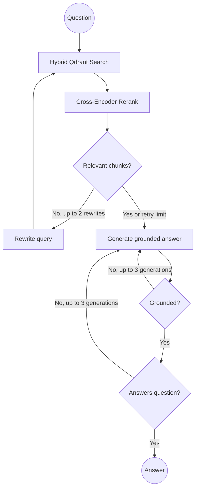

# Enterprise Agentic RAG Pipeline


A research-paper question-answering prototype built around a cyclic LangGraph workflow. It combines hybrid dense and sparse retrieval, cross-encoder reranking, document relevance grading, query rewriting, grounded answer generation, and post-generation LLM checks.

The project is designed for local experimentation and evaluation. It does not currently provide authentication, document uploads, citations in API responses, streaming, health checks, or production-grade guarantees against hallucination. When the retry limits are exhausted, the agent returns its best available answer.

## System Architecture



The API initializes the agent during FastAPI startup. Each request retrieves up to 15 candidates with Qdrant Reciprocal Rank Fusion, reranks them, keeps the best 3 chunks, and runs the grading and generation loop. The frontend displays a collapsed status panel while the request is running; that panel is UI feedback and is not a server-side execution trace.

## Technical Stack

| Layer          | Implementation                                                                                   |
| -------------- | ------------------------------------------------------------------------------------------------ |
| Orchestration  | LangGraph and LangChain                                                                          |
| LLM            | Groq OpenAI-compatible endpoint using `openai/gpt-oss-20b`                                       |
| Vector storage | Embedded local Qdrant at `data/qdrant_db`                                                        |
| Embeddings     | FastEmbed `BAAI/bge-small-en-v1.5` dense vectors and `prithivida/Splade_PP_en_v1` sparse vectors |
| Reranking      | FastEmbed `Xenova/ms-marco-MiniLM-L-6-v2` cross-encoder                                          |
| PDF parsing    | Docling layout conversion and hierarchical chunking                                              |
| Backend        | FastAPI and Uvicorn                                                                              |
| Frontend       | Streamlit and Requests                                                                           |
| Evaluation     | DeepEval faithfulness and answer-relevancy metrics with a Groq judge                             |

## Retrieval And Guardrails

1. **Hybrid retrieval:** dense and sparse searches are fused with Qdrant RRF. The agent requests 15 candidates.
2. **Reranking:** a cross-encoder scores the candidates and supplies only the top 3 chunks to the next stage.
3. **Document grading:** an LLM drops chunks that do not help answer the question.
4. **Query rewriting:** if no relevant chunks remain, the LLM rewrites the question in academic terminology and retries retrieval at most twice.
5. **Grounded generation:** the answer prompt instructs the LLM to use only the retrieved chunks.
6. **Answer grading:** hallucination and utility graders can route back to generation. Generation is capped at three attempts, after which the latest answer is returned.

## Quickstart With Docker

Prerequisites: Docker Desktop with Compose support and a Groq API key.

From the repository root, create `backend/.env` with:

```dotenv
GROQ_API_KEY=your_api_key_here
```

Then start the two application containers:

```bash
docker compose up --build
```

Open:

- Streamlit UI: http://localhost:8501
- FastAPI Swagger UI: http://localhost:8000/docs

Compose starts only the backend and frontend. Qdrant is not a separate container; the backend uses Qdrant's embedded local client. The Compose file mounts `./data` at `/app/data`, but the current path calculation in the backend resolves its data directory differently inside the image. For dependable indexing and local development, use the native workflow below or update that path handling before relying on a Docker-only deployment.

## Native Setup And Indexing

The repository includes the Attention Is All You Need PDF, its parsed Markdown, and a local Qdrant database. Indexing is manual; application startup does not parse or index documents.

From the repository root, create a Python 3.10 environment and install the backend dependencies:

```bash
python -m venv .venv
# Windows PowerShell
.\.venv\Scripts\Activate.ps1
pip install -r backend/requirements.txt
```

The DeepEval test also requires its separate package:

```bash
pip install deepeval
```

Set `GROQ_API_KEY` in `backend/.env`, then run the indexing script from the repository root:

```bash
python -m backend.app.retrieval.vector_store
```

The script parses `data/sample_papers/attention_is_all_you_need.pdf`, creates hierarchical chunks, embeds them, and upserts them into the `ai_research_papers` collection. To inspect Docling parsing without indexing, run:

```bash
python -m backend.app.engine.parser
```

Run the backend and frontend separately when using the native workflow:

```bash
uvicorn app.main:app --app-dir backend --reload --port 8000
streamlit run frontend/app.py
```

The frontend defaults to `http://localhost:8000/api/v1/research/query`. Set `API_URL` to override it, for example when the frontend runs in a container.

## API

### `POST /api/v1/research/query`

Request bodies must contain a query of at least five characters:

```json
{
  "query": "What optimizer was used?"
}
```

Successful responses contain only the final answer:

```json
{
  "answer": "..."
}
```

Typical errors are `422` for invalid request data, `503` when the startup agent is unavailable, and `500` when graph execution fails. There is currently no upload, indexing, citation, trace, or health endpoint.

## Evaluation

`tests/test_agent.py` is a live integration/evaluation test rather than a deterministic unit test. It initializes the real agent, uses the indexed Qdrant data and downloaded embedding/reranker models, and evaluates the result with DeepEval using a Groq judge. Both metrics use a passing threshold of `0.7`; scores depend on the model response and runtime state.

Run it from the repository root after indexing the data and configuring `GROQ_API_KEY`:

```bash
pytest tests/test_agent.py
```

The test requires network access for the Groq API and model downloads. No fixed score is guaranteed by the repository.

## Repository Structure

```text
├── backend/
│   ├── app/
│   │   ├── agent/graph.py          # LangGraph workflow, graders, and routers
│   │   ├── api/v1/                 # API package namespace
│   │   ├── engine/parser.py        # Docling PDF parsing and chunking
│   │   ├── retrieval/vector_store.py # Local Qdrant and hybrid retrieval
│   │   └── main.py                 # FastAPI application and endpoint
│   ├── Dockerfile
│   └── requirements.txt
├── data/
│   ├── qdrant_db/                  # Embedded Qdrant collection data
│   └── sample_papers/               # Sample PDF and parsed Markdown
├── frontend/app.py                 # Streamlit chat interface
├── tests/test_agent.py             # DeepEval integration evaluation
├── docker-compose.yml
└── README.md
```
