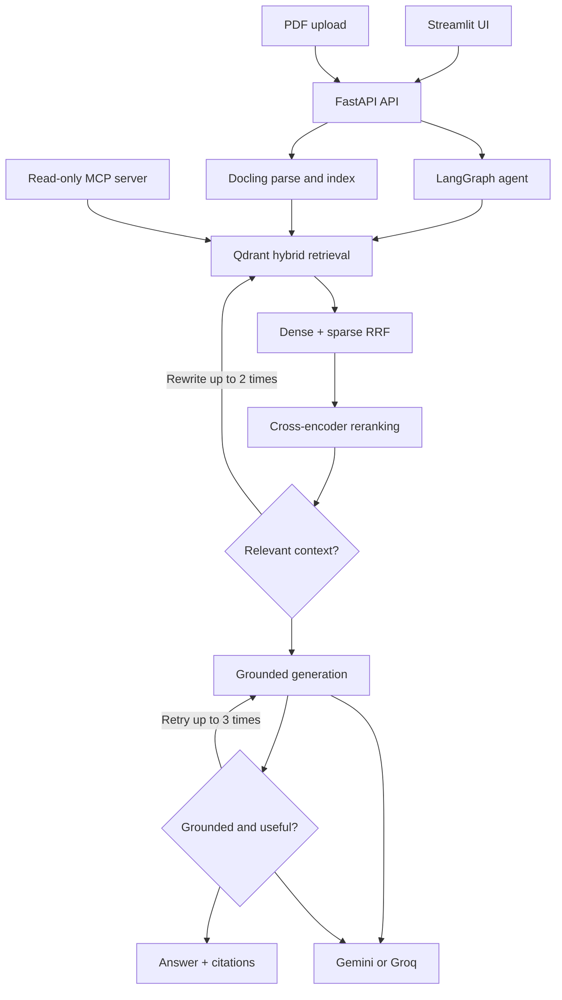

# Autonomous Context Engine (ACE)


ACE is a research-document question-answering system built with LangGraph. It combines hybrid retrieval, reranking, document grading, query rewriting, and grounded generation.

## Architecture



## Key Features

- Hybrid dense and sparse retrieval with Qdrant
- Cross-encoder reranking of retrieved chunks
- LLM-based relevance, grounding, and answer grading
- Automatic query rewriting with retry limits
- PDF parsing and hierarchical chunking with Docling
- FastAPI backend, Streamlit frontend, and read-only MCP server
- Google Gemini by default, with optional Groq support

## Stack

| Area | Technology |
| --- | --- |
| Orchestration | LangGraph, LangChain |
| LLM | Google Gemini or Groq |
| Vector store | Embedded Qdrant at `data/qdrant_db` |
| Embeddings | BGE dense and SPLADE sparse vectors |
| Reranking | MS MARCO cross-encoder |
| PDF parsing | Docling |
| Backend / frontend | FastAPI / Streamlit |
| Evaluation | DeepEval |

## Quickstart with Docker

Create `backend/.env`:

```dotenv
GOOGLE_API_KEY=your_gemini_api_key_here
```

Start the application:

```bash
docker compose up --build
```

Open:

- Streamlit: http://localhost:8501
- FastAPI docs: http://localhost:8000/docs

## Native Setup and Indexing

```bash
python -m venv .venv
# Windows PowerShell
.\.venv\Scripts\Activate.ps1
pip install -r backend/requirements.txt
```

Add `GOOGLE_API_KEY` to `backend/.env`, then index the sample paper:

```bash
python -m backend.app.retrieval.vector_store
```

Run the services:

```bash
uvicorn app.main:app --app-dir backend --reload --port 8000
streamlit run frontend/app.py
```

## API

### Query documents

`POST /api/v1/research/query`

```json
{"query": "What optimizer was used?"}
```

Returns an answer with source filenames, headings, pages, and snippets.

### Upload a PDF

`POST /api/v1/research/documents`

Upload one PDF using the multipart field `file`. It is parsed and indexed in Qdrant.

## MCP Server

Run from the `backend` directory:

```bash
cd backend
python -m app.mcp.server
```

Tools:

- `query_documentation(query, num_results)`
- `list_indexed_documents()`

The server is read-only and does not provide shell access, arbitrary code execution, filesystem writes, or unrestricted network access.

## Configuration

Gemini is the default provider. Optional fallback keys and Groq support:

```dotenv
GOOGLE_API_KEY=your_gemini_key
GOOGLE_API_KEYS=backup_key_1,backup_key_2
GOOGLE_MODEL=gemini-3.7-flash
GROQ_API_KEY=your_groq_key
GROQ_MODEL=openai/gpt-oss-20b
GENERATION_PROVIDER=google
CRITIQUE_PROVIDER=google
```

Never commit real API keys.

## Evaluation

After indexing the data and configuring an API key:

```bash
pytest tests/test_agent.py
```

The live evaluation requires network access, provider quota, indexed data, and downloaded models.

## Repository Structure

```text
backend/app/agent/graph.py
backend/app/core/llm.py
backend/app/engine/parser.py
backend/app/mcp/server.py
backend/app/retrieval/vector_store.py
backend/app/main.py
frontend/app.py
data/
tests/
docker-compose.yml
README.md
```
