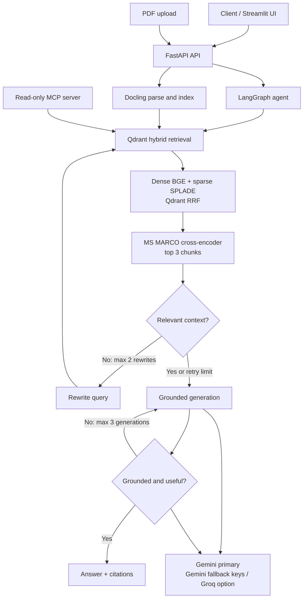

# Autonomous Context Engine (ACE)


An agentic research-document question-answering system built around a cyclic LangGraph workflow. It combines hybrid dense and sparse retrieval, cross-encoder reranking, document relevance grading, query rewriting, grounded answer generation, citations, read-only MCP tools, and post-generation LLM checks.

The project is designed for local experimentation and evaluation. It does not currently provide authentication or streaming. Query responses include the retrieved source filename, heading, snippet, and page when Docling exposes page provenance. When the retry limits are exhausted, the agent returns its best available answer.

## System Architecture



The API initializes the agent during FastAPI startup. Each request retrieves up to 15 candidates with Qdrant Reciprocal Rank Fusion, reranks them, keeps the best 3 chunks, and runs the grading and generation loop. Gemini credentials are tried in order when `GOOGLE_API_KEYS` is configured. The frontend displays a collapsed status panel while the request is running; that panel is UI feedback and is not a server-side execution trace.

## Technical Stack

| Layer          | Implementation                                                                                   |
| -------------- | ------------------------------------------------------------------------------------------------ |
| Orchestration  | LangGraph and LangChain                                                                          |
| LLM            | Google Gemini by default, with optional Groq OpenAI-compatible endpoint                          |
| Vector storage | Embedded local Qdrant at `data/qdrant_db`                                                        |
| Embeddings     | FastEmbed `BAAI/bge-small-en-v1.5` dense vectors and `prithivida/Splade_PP_en_v1` sparse vectors |
| Reranking      | FastEmbed `Xenova/ms-marco-MiniLM-L-6-v2` cross-encoder                                          |
| PDF parsing    | Docling layout conversion and hierarchical chunking                                              |
| Backend        | FastAPI and Uvicorn                                                                              |
| Frontend       | Streamlit and Requests                                                                           |
| Evaluation     | DeepEval faithfulness and answer-relevancy metrics with a configurable Gemini/Groq judge          |

## Retrieval And Guardrails

1. **Hybrid retrieval:** dense and sparse searches are fused with Qdrant RRF. The agent requests 15 candidates.
2. **Reranking:** a cross-encoder scores the candidates and supplies only the top 3 chunks to the next stage.
3. **Document grading:** an LLM drops chunks that do not help answer the question.
4. **Query rewriting:** if no relevant chunks remain, the LLM rewrites the question in academic terminology and retries retrieval at most twice.
5. **Grounded generation:** the answer prompt instructs the LLM to use only the retrieved chunks.
6. **Answer grading:** hallucination and utility graders can route back to generation. Generation is capped at three attempts, after which the latest answer is returned.

## Quickstart With Docker

Prerequisites: Docker Desktop with Compose support and a Google Gemini API key.

From the repository root, create `backend/.env` with:

```dotenv
GOOGLE_API_KEY=your_gemini_api_key_here
```

Then start the two application containers:

```bash
docker compose up --build
```

Open:

- Streamlit UI: http://localhost:8501
- FastAPI Swagger UI: http://localhost:8000/docs

Compose starts only the backend and frontend. Qdrant is not a separate container; the backend uses Qdrant's embedded local client. The Compose file mounts `./data` at `/app/data`, but the current path calculation in the backend resolves its data directory differently inside the image. For dependable indexing and local development, use the native workflow below or update that path handling before relying on a Docker-only deployment.

## Native Setup And Indexing

The repository includes the Attention Is All You Need PDF, its parsed Markdown, and a local Qdrant database. Indexing is manual; application startup does not parse or index documents.

From the repository root, create a Python 3.10 environment and install the backend dependencies:

```bash
python -m venv .venv
# Windows PowerShell
.\.venv\Scripts\Activate.ps1
pip install -r backend/requirements.txt
```

Set `GOOGLE_API_KEY` in `backend/.env`, then run the indexing script from the repository root:

```bash
python -m backend.app.retrieval.vector_store
```

`GOOGLE_API_KEY` must be a Gemini API key that succeeds with the Google
Generative Language API. Optional fallback keys can be supplied through
`GOOGLE_API_KEYS` as a comma-separated list. Create or manage keys in
[Google AI Studio](https://aistudio.google.com/apikey). Keep the key in the
ignored `backend/.env` file and never commit it.

The script parses `data/sample_papers/attention_is_all_you_need.pdf`, creates hierarchical chunks, embeds them, and upserts them into the `ai_research_papers` collection. To inspect Docling parsing without indexing, run:

```bash
python -m backend.app.engine.parser
```

Run the backend and frontend separately when using the native workflow:

```bash
uvicorn app.main:app --app-dir backend --reload --port 8000
streamlit run frontend/app.py
```

The frontend defaults to `http://localhost:8000/api/v1/research/query`. Set `API_URL` to override it, for example when the frontend runs in a container.

## API

### `POST /api/v1/research/query`

Request bodies must contain a query of at least five characters:

```json
{
  "query": "What optimizer was used?"
}
```

Successful responses contain the final answer and the sources used by the retrieval pipeline:

```json
{
  "answer": "...",
  "sources": [
    {
      "source_file": "attention_is_all_you_need.pdf",
      "heading": "Optimization",
      "page": 5,
      "snippet": "..."
    }
  ]
}
```

`page` is optional because it depends on provenance metadata emitted by the parser. Typical errors are `422` for invalid request data, `503` when the startup agent is unavailable, and `500` when graph execution fails. There is currently no streaming endpoint.

### `POST /api/v1/research/documents`

Upload one PDF using the multipart field `file`. The document is parsed with the current Docling pipeline and indexed in the current Qdrant collection. Existing documents are detected by filename and are not indexed twice.

Successful responses contain the filename and number of indexed chunks:

```json
{
  "source_file": "manual.pdf",
  "indexed": true,
  "chunks_indexed": 12,
  "detail": "Indexed 12 chunks."
}
```

## Read-Only MCP Server

The merged project exposes the current Qdrant knowledge base through a read-only MCP server. It provides:

- `query_documentation(query, num_results)`: hybrid-search indexed documents and return source metadata and snippets.
- `list_indexed_documents()`: list indexed source filenames.

Run it from the `backend` directory after installing backend dependencies:

```bash
cd backend
python -m app.mcp.server
```

The MCP server does not expose arbitrary Python execution, shell commands, filesystem writes, package installation, or unrestricted network access.

## Evaluation

`tests/test_agent.py` is a live integration/evaluation test rather than a deterministic unit test. It initializes the real agent, uses the indexed Qdrant data and downloaded embedding/reranker models, and evaluates the result with DeepEval using a Gemini judge. Both metrics use a passing threshold of `0.7`; scores depend on the model response and runtime state. It requires `GOOGLE_API_KEY`, network access, model downloads, and an indexed Qdrant collection.

Run it from the repository root after indexing the data and configuring `GOOGLE_API_KEY`:

```bash
pytest tests/test_agent.py
```

The test requires network access for the Google API and model downloads. No fixed score is guaranteed by the repository. The deterministic API, citation, indexing, and MCP tests do not require an API key.

The repository currently collects 11 tests: 10 deterministic tests and 1 live
DeepEval evaluation. The live test depends on provider availability, quota,
network access, indexed data, and downloaded models; it is not counted as a
deterministic regression result.

## LLM Provider Configuration

Gemini is the default provider for both answer generation and critique. The
primary key is tried first; optional comma-separated fallback keys are used
when the primary request fails, including quota/rate-limit and transient
service errors:

```dotenv
GOOGLE_API_KEY=your_key
GOOGLE_API_KEYS=your_backup_key_1,your_backup_key_2
GOOGLE_MODEL=gemini-3.7-flash
GENERATION_PROVIDER=google
CRITIQUE_PROVIDER=google
```

Use separate keys from the same project only as a quota-resilience mechanism;
they do not create additional quota for a project-level quota limit. For
independent capacity, configure a separate project with its own billing and
quota, or use the Groq critique provider.

The pipeline also supports a dual-provider setup. In this mode, Gemini generates and rewrites answers while Groq independently grades relevance, grounding, and answer utility:

```dotenv
GOOGLE_API_KEY=your_gemini_key
GROQ_API_KEY=your_groq_key
GOOGLE_MODEL=gemini-3.7-flash
GROQ_MODEL=openai/gpt-oss-20b
GENERATION_PROVIDER=google
CRITIQUE_PROVIDER=groq
```

This separates generation from evaluation so the same model does not approve its own answer. Switch both provider settings to `groq` for a Groq-only setup. Keep all real keys in the ignored `backend/.env`; never commit them or place them in documentation.

## Repository Structure

```text
├── backend/
│   ├── app/
│   │   ├── agent/graph.py          # LangGraph workflow, graders, and routers
│   │   ├── api/v1/                 # API package namespace
│   │   ├── core/llm.py             # Gemini/Groq providers and key failover
│   │   ├── engine/parser.py        # Docling PDF parsing and chunking
│   │   ├── mcp/server.py           # Read-only MCP tools
│   │   ├── retrieval/vector_store.py # Local Qdrant and hybrid retrieval
│   │   ├── schemas/research.py     # Query, citation, and indexing schemas
│   │   └── main.py                 # FastAPI application and endpoints
│   ├── .env.example                # Safe local configuration template
│   ├── Dockerfile
│   └── requirements.txt
├── data/
│   ├── qdrant_db/                  # Embedded Qdrant collection data
│   └── sample_papers/               # Sample PDF and parsed Markdown
├── frontend/app.py                 # Streamlit chat interface
├── tests/                          # Deterministic and live evaluation tests
├── docker-compose.yml
└── README.md

