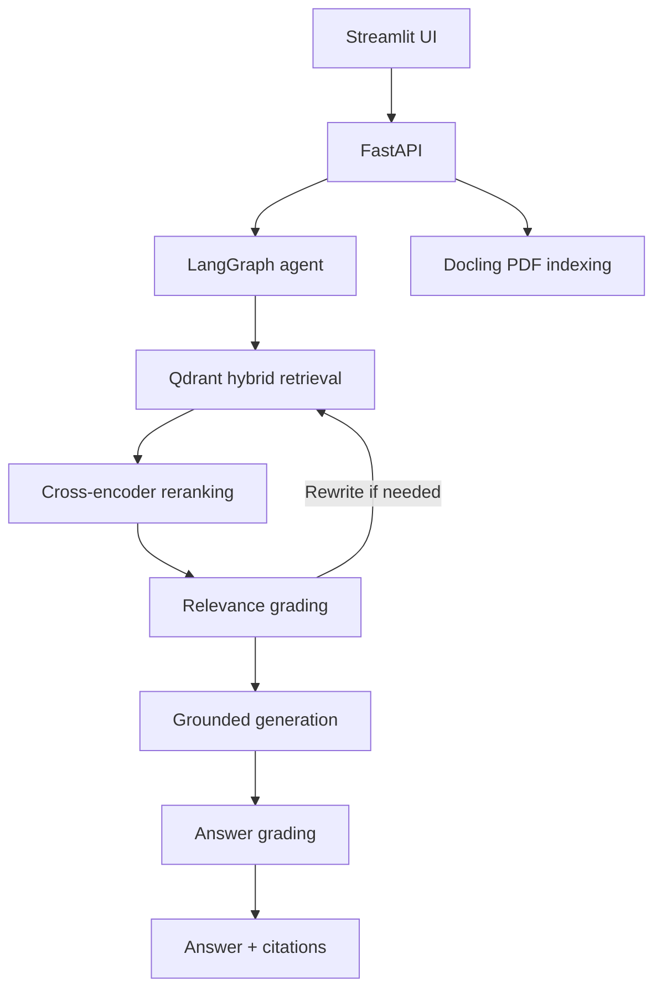

# Autonomous Context Engine (ACE)


ACE is a research-document question-answering system built with LangGraph. It uses hybrid retrieval, reranking, relevance grading, query rewriting, and grounded answer generation.

Designed for local experimentation. Authentication and streaming are not currently included.

## Features

- Hybrid dense and sparse retrieval with Qdrant RRF
- Cross-encoder reranking
- LLM-based document and answer grading
- Automatic query rewriting and retry limits
- PDF upload, parsing, and indexing with Docling
- FastAPI backend and Streamlit frontend
- Read-only MCP server for searching indexed documents
- Gemini by default, with optional Groq support

## Architecture



## Stack

- **Orchestration:** LangGraph and LangChain
- **LLM:** Google Gemini or Groq
- **Storage:** Embedded local Qdrant in `data/qdrant_db`
- **Embeddings:** BGE dense vectors and SPLADE sparse vectors
- **Reranking:** MS MARCO cross-encoder
- **Backend:** FastAPI and Uvicorn
- **Frontend:** Streamlit
- **Evaluation:** DeepEval

## Quickstart with Docker

Create `backend/.env`:

```dotenv
GOOGLE_API_KEY=your_gemini_api_key_here
```

Start the application:

```bash
docker compose up --build
```

Open the UI at http://localhost:8501 or the API docs at http://localhost:8000/docs.

## Native Setup

```bash
python -m venv .venv
# Windows PowerShell
.\.venv\Scripts\Activate.ps1
pip install -r backend/requirements.txt
```

Add `GOOGLE_API_KEY` to `backend/.env`, then index the sample document:

```bash
python -m backend.app.retrieval.vector_store
```

Run the services:

```bash
uvicorn app.main:app --app-dir backend --reload --port 8000
streamlit run frontend/app.py
```

## API

### Query documents

`POST /api/v1/research/query`

```json
{"query": "What optimizer was used?"}
```

Returns an answer with source filenames, headings, pages, and snippets.

### Upload a document

`POST /api/v1/research/documents`

Upload a PDF using the multipart field `file`. The document is parsed and added to the Qdrant collection.

## MCP Server

Run the read-only MCP server from `backend`:

```bash
python -m app.mcp.server
```

Available tools:

- `query_documentation(query, num_results)`
- `list_indexed_documents()`

The server does not provide shell access, arbitrary code execution, filesystem writes, or unrestricted network access.

## Provider Configuration

Gemini is the default provider. Optional fallback keys and Groq critique support can be configured in `backend/.env`:

```dotenv
GOOGLE_API_KEY=your_gemini_key
GOOGLE_API_KEYS=backup_key_1,backup_key_2
GOOGLE_MODEL=gemini-3.7-flash
GROQ_API_KEY=your_groq_key
GROQ_MODEL=openai/gpt-oss-20b
GENERATION_PROVIDER=google
CRITIQUE_PROVIDER=google
```

Never commit real API keys.

## Evaluation

Run the live evaluation after indexing documents and configuring an API key:

```bash
pytest tests/test_agent.py
```

The live test requires network access, provider quota, indexed data, and downloaded models.

## Repository Structure

```text
backend/app/agent/graph.py              # LangGraph workflow
backend/app/core/llm.py                 # LLM providers and failover
backend/app/engine/parser.py            # PDF parsing and chunking
backend/app/mcp/server.py               # Read-only MCP tools
backend/app/retrieval/vector_store.py   # Qdrant retrieval and indexing
backend/app/schemas/research.py         # API schemas
backend/app/main.py                     # FastAPI application
frontend/app.py                         # Streamlit UI
data/                                   # PDFs and Qdrant data
tests/                                  # Test suite
docker-compose.yml                      # Container configuration
```
